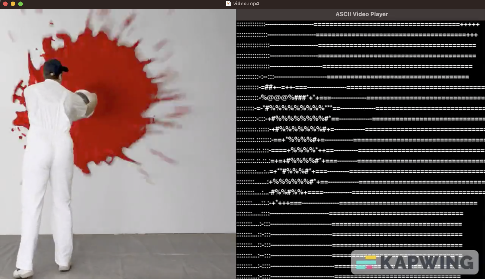

# Video to ASCII Converter

Convert your video into ASCII art and create ASCII videos.




## Introduction
This project allows you to convert a video into ASCII art and create ASCII videos. It consists of two main components:
1. **video-to-ascii:** Converts a video to a sequence of ASCII frames and saves them in the "asciitxt" folder.
2. **ascii-to-video:** Compiles the ASCII frames back into an ASCII video and saves it as an output video file.
3. **asciiToVid.py** converts the ascii folder to a cool video

## Features
- Video to ASCII conversion using OpenCV and Pillow.
- ASCII to video compilation with OpenCV.
- Example video and ASCII frames provided for testing.
- Customizable ASCII characters for different shades.
- Easy-to-use scripts for video to ASCII and ASCII to video conversion.

## Requirements
- Python 3.x
- Required Python libraries: OpenCV and Pillow (PIL).

## Installation
1. Clone the repository:
   ```sh
   git clone https://github.com/dimitric/video-to-ascii.git
   cd video-to-ascii
